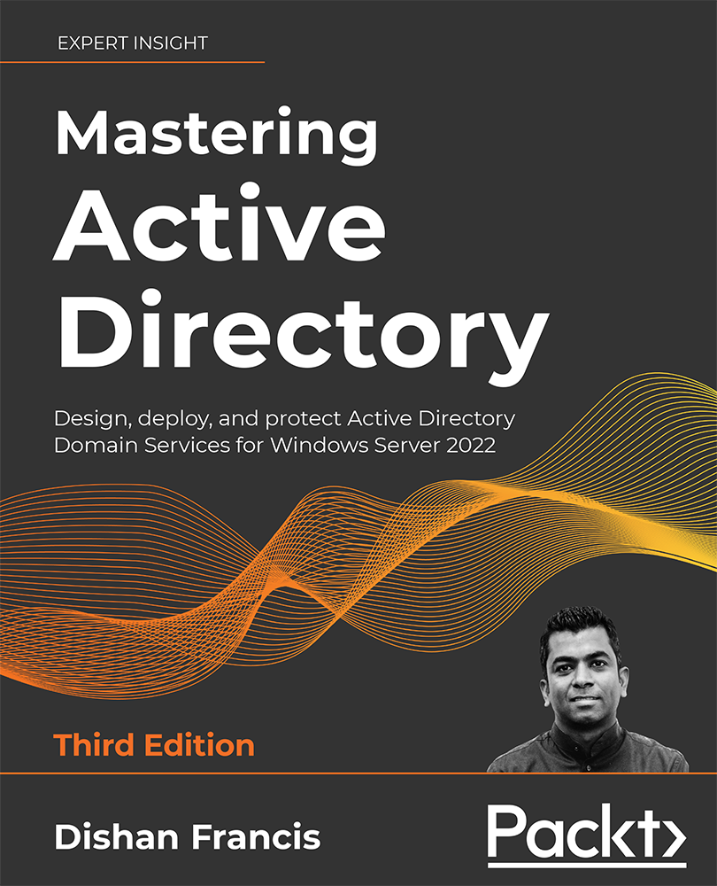

### Get this product for $5

<i>Packt is having its biggest sale of the year. Get this eBook or any other book, video, or course that you like just for $5 each</i>

<b>
[Buy now](https://packt.link/9781801070393)
</b>

<b>
[Buy similar titles for just $5](https://subscription.packtpub.com/search)
</b>

# Mastering-Active-Directory-Third-Edition
Mastering Active Directory, Third Edition , Published by Packt

# Mastering Active Directory, Third Edition

Become an expert at managing enterprise identity infrastructure with Active Directory Domain Services 2022
## Links

* [Amazon](https://www.amazon.com/Mastering-Active-Directory-protect-Services/dp/1801070393/ref=sr_1_3?keywords=dishan+francis&qid=1638187369&sr=8-3)
* [Packt Publishing](https://www.packtpub.com/product/mastering-active-directory-third-edition/9781801070393)

## Key Features
Design and update your identity infrastructure by utilizing the latest Active Directory features and core capabilities.
Overcome migration challenges as you update to Active Directory Domain Services 2022
Establish a strong identity foundation in the cloud by consolidating secure access.

## What you will learn
- Install, protect, and manage Active Directory Domain Services (Windows Server 2022)
- Design your hybrid identity by evaluating business and technology requirements
- Automate administrative tasks in Active Directory using Windows PowerShell 7.x
- Protect sensitive data in a hybrid environment using Azure Information Protection
- Learn about Flexible Single Master Operation (FSMO) roles and their placement
- Manage directory objects effectively using administrative tools and PowerShell
- Centrally maintain the state of user and computer configuration by using Group Policies
- Harden your Active Directory using security best practices

## Who This Book Is For
If you are an Active Directory administrator, system administrator, or IT professional who has basic knowledge of Active Directory and is looking to become an expert in this topic, this book is for you.
You need to have some experience of working with Active Directory to make the most of this book.

### Download a free PDF

 <i>If you have already purchased a print or Kindle version of this book, you can get a DRM-free PDF version at no cost. Simply click on the link to claim your free PDF.</i>

 <a href="https://packt.link/free-ebook/9781801070393">https://packt.link/free-ebook/9781801070393 </a> 
